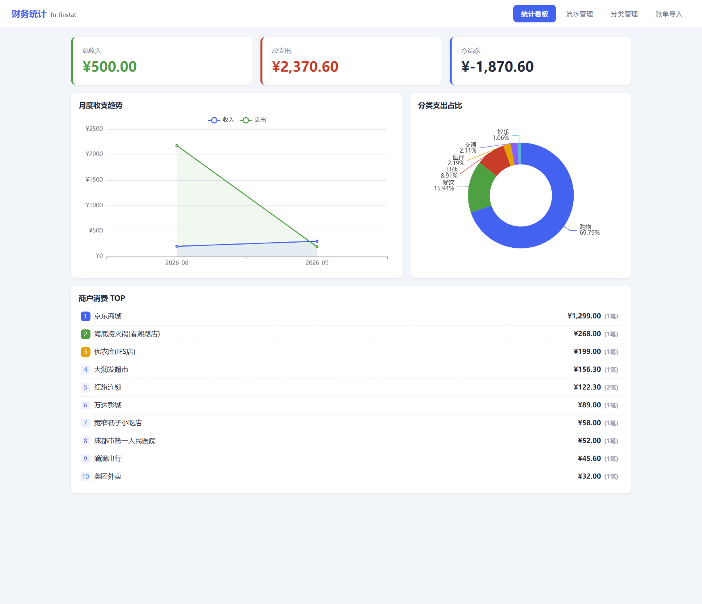
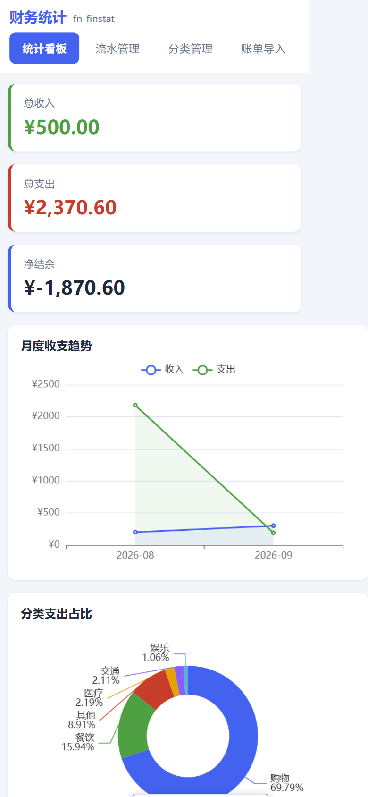
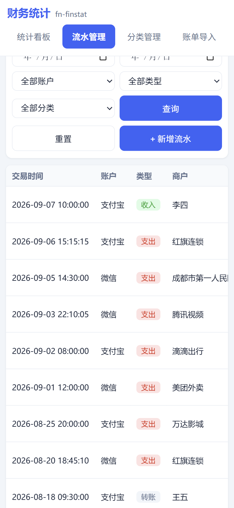
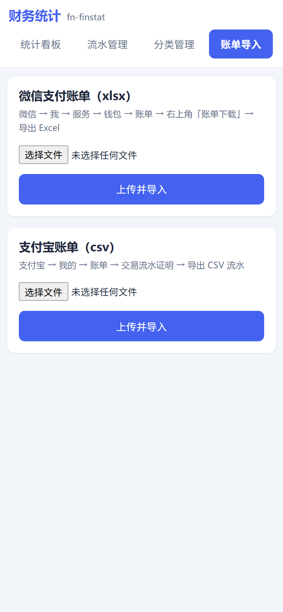
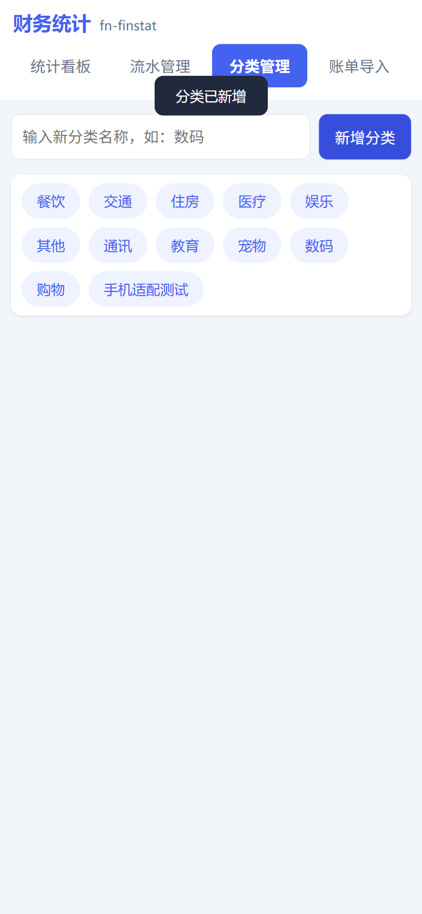

# 财务统计 · 界面设计方案（v0.4 改版）

| 项 | 内容 |
| --- | --- |
| 文档版本 | v1.0（对应应用 0.4.0） |
| 制定日期 | 2026-09-13 |
| 文档状态 | **已落地**（设计系统与组件改造均已实现并验证） |
| 适用范围 | `frontend/src` 全部界面，构建产物输出至 `app/static` |
| 关联文档 | `docs/飞牛主题适配与图标方案.md` · `frontend/src/assets/style.css`（样式单源） |
| 索引 | `docs/README.md` |

> 设计方向：**温暖金融科技（Warm Fintech）**
> 交付形态：设计系统规范 + 已落地的 Vue 组件改造

---

## 一、设计目标与约束

### 这个界面是谁在用

不是企业财务在核对报表，而是**一个人在记录自己的钱**。场景是：

- 手机上随手看一眼本月花了多少，或者在电脑前坐下来对账
- 导入四家平台的账单后，想知道「钱去哪了」
- 偶尔改一笔分类、打个报销标签
- 长期使用，隔三差五就会打开

这决定了三个设计取向：

| 取自实际的判断 | 设计取向 |
| --- | --- |
| 私人账本，长期高频 | 视觉要**耐看**，不用高饱和撞色；暖底避免久看刺眼 |
| 用户要看的是数字 | **数字必须是主角**——等宽对齐、语义着色、层级分明 |
| 手机与电脑都会用 | 两套布局形态，而非一套布局硬缩 |

### 硬约束

- **必须保持功能完整**：全部 30+ 个接口、6 个页面、所有交互一个不能少
- **必须保留双主题**：`auto / light / dark` 三态切换与首屏无闪烁逻辑不变
- **必须保留 PWA 与移动端适配**：产物结构、Service Worker 策略不变
- **不能引入新依赖**：前端仍为 Vue 3 + ECharts，包体不显著增长

---

## 二、视觉语言

### 2.1 色彩系统

从原来的**商务蓝**改用**深墨绿（Pine）**作为主色。原因：蓝色是所有后台系统的默认色，缺乏识别度；墨绿更安静、有质感，也更贴合「账本」这个带手工感的物件。

**基础调色板**

| 色系 | 令牌前缀 | 用途 | 代表值（浅色主题） |
| --- | --- | --- | --- |
| 深墨绿 | `--pine-*` | 主色、品牌识别、焦点态 | `--pine-600` `#2d5443` |
| 暖米白 | `--paper-*` | 背景、表面、边框、中性文字 | `--paper-100` `#f5f2ec` |
| 墨色 | `--ink-*` | 正文与标题文字 | `--ink-900` `#1a1f1d` |
| 铜金 | `--brass-*` | 点缀、装饰性强调 | `--brass-500` `#c19434` |
| 暖红 | `--clay-*` | 收入、危险操作 | `--clay-500` `#c05548` |
| 苔绿 | `--moss-*` | 支出 | `--moss-500` `#47825f` |
| 琥珀 | `--amber-*` | 预警、接近超支 | `--amber-500` `#d99b3c` |

**收支语义色 — 重要决策**

本应用遵循中国用户的金钱直觉：**收入偏红、支出偏绿**。这与主色（墨绿）刻意区分开，避免「主色即支出色」造成误读。

```css
--color-income: var(--clay-500);    /* 收入 · 暖红 */
--color-expense: var(--moss-500);   /* 支出 · 苔绿 */
```

> 实现说明：不同于欧美市场「涨绿跌红」的惯例，此处按中国用户习惯设定。转账类型使用中性灰，避免被误认为收支。

**语义映射层（组件只允许引用这一层）**

```
--color-primary / -hover / -soft / -ring / --color-on-primary
--color-income / -soft        --color-expense / -soft
--color-warn / -soft          --color-danger / -soft       --color-neutral / -soft
--color-bg / -elevated        --color-surface / -sunken / -hover
--color-border / -strong / -divider
--color-text / -secondary / -tertiary / -inverse
--color-input-bg / -border / -focus / -placeholder
--color-mask  --color-tooltip-bg / -text
--chart-text / -subtext / -splitline / -tooltip-bg / -tooltip-border
```

**四层令牌结构**：基础调色板 → 语义映射（浅色）→ 语义映射（暗色）→ 尺度。组件中**不出现任何硬编码色值**，换肤只需替换 `html.dark` 下的映射块。

### 2.2 字体与数字

```
--font-sans    系统字体栈（PingFang SC / Microsoft YaHei / Source Han Sans）
--font-mono    等宽字体栈
--font-numeric 指向 mono —— 金额专用
```

**字号阶梯**（11 → 36px，整阶对齐）

| 令牌 | 值 | 用途 |
| --- | --- | --- |
| `--text-2xs` | 11px | 徽标、角标、卡片副信息 |
| `--text-xs` | 12px | 说明文字、表头、时间戳 |
| `--text-sm` | 13px | 次要标签、表格辅助列 |
| `--text-base` | 14px | 正文、按钮、输入框 |
| `--text-md` | 15px | 区块标题、移动端金额 |
| `--text-lg` | 17px | 弹窗标题、页面标题 |
| `--text-2xl` | 24px | 移动端汇总数值 |
| `--text-3xl` | 30px | 桌面端汇总数值 |

**核心规则：凡金额必用 `--font-numeric` 并启用 `tabular-nums`。**

这是整个改造中被反复强调的一条。等宽数字让金额在纵向形成稳定对齐的可比列 —— 用户扫一眼就能比较大小，而不需要逐位读。这是财务界面可读性的地基。

### 2.3 间距、圆角、阴影、动效

**间距**：4px 基准的完整阶梯（`2, 4, 6, 8, 10, 12, 14, 16, 20, 24, 28, 32, 40, 48`），所有留白都从此取，禁止魔法数字。

**圆角**：`--radius-sm 6px`（小控件）/ `md 9px`（按钮、输入）/ `lg 13px`（卡片）/ `xl 18px`（弹窗）/ `pill 999px`（标签）

**阴影**：使用**暖调阴影**（`rgba(26,31,29,…)`）而非纯黑，避免在暖米白底上显出脏灰。四个层级 `xs / sm / md / lg / xl`，暗色主题单独一组更重的值。

**动效**：
```
--ease-out: cubic-bezier(0.22, 0.61, 0.36, 1)   /* 入场，快出慢停 */
--dur-fast: 130ms /* 悬停反馈 */   --dur-base: 200ms /* 状态切换 */   --dur-slow: 320ms /* 面板进场 */
```

并**全局尊重 `prefers-reduced-motion`**，用户若在系统中关闭动效，所有动画归零。

---

## 三、布局架构

### 3.1 从「横向标签」到「侧边导航 + 底部 Tab」

原设计把 6 个入口塞在顶栏一排，在窄屏需要横滑、还挤压品牌区。

```
桌面（>860px）                    移动（<=860px）
┌──────────┬──────────────────┐   ┌─────────────────────┐
│ ● 财务统计 │ 流水管理          │   │ 流水管理       [+] │ ← 顶栏
│          │ ─────────────── │   ├─────────────────────┤
│ 账本      │                  │   │                     │
│  统计看板 │   内容区          │   │      内容区（单列）  │
│ ▸流水管理 │                  │   │                     │
│  资产管理 │                  │   │                     │
│ 数据      │                  │   ├─────────────────────┤
│  账单导入 │                  │   │看板 流水 资产 导入 设置│ ← 底部 Tab
│  分类管理 │                  │   └─────────────────────┘
│  设置     │                  │
│ ──────── │                  │
│ ☀ 主题    │                  │
└──────────┴──────────────────┘
```

**导航分两组**，按用户心智而非功能清单组织：

- **账本**（看数据）：统计看板 / 流水管理 / 资产管理
- **数据**（改数据）：账单导入 / 分类管理 / 设置

移动端底部只放 5 项（分类管理低频，从设置页入口进入），并按 Fitts 定律放大触摸目标，兼容 `env(safe-area-inset-bottom)` 适配全面屏。

### 3.2 响应式断点

| 断点 | 变化 |
| --- | --- |
| `>1180px` | 桌面完整布局 |
| `<=1180px` | 汇总卡由 3 列转 2 列，主卡跨满行 |
| `<=1024px` | 图表并排转单列 |
| `<=860px` | 侧边栏 → 底部 Tab；表格 → 卡片；筛选栏重排 |
| `<=400px` | 导航文字缩至 10px |

**移动端专项处理**：输入框字号强制 16px 防 iOS 聚焦自动放大页面；`<input type="date">` 在移动端占 44% 宽并放大触摸区。

---

## 四、核心痛点攻坚：流水表

这是本次改造的重点，因为流水页是最常打开的页面，而原设计的信息密度与可读性都到了临界点。

### 4.1 问题诊断

原实现是 9 列挤在一张表里：

```
☑ | 交易时间 | 账户 | 类型 | 商户 | 金额 | 分类 | 标签 | 备注 | 操作
   2026-09-13 12:30:45  微信  支出  某某餐厅  ¥38.50  餐饮  -  午餐  [编辑][删除]
```

四个具体问题：

1. **金额难比** —— 比例字体 + 左对齐，纵向无法对齐比较
2. **方向要心算** —— 有「类型」列，但金额本身不体现进出，得左右对照
3. **操作抢焦点** —— 每行两个实体按钮，视觉噪音大且占宽度
4. **移动端横滑** —— 表格最小宽度 560px，手机上必须左右拖

### 4.2 改造方案

**① 金额成为视觉重心**

```html
<td class="money-cell" :class="amountClass(b.tx_type)">
  {{ fmtSignedMoney(b.amount, b.tx_type) }}   <!-- -¥38.50 -->
  <small>{{ fmtType(b.tx_type) }}</small>       <!-- 支出 -->
</td>
```

- 等宽数字 + 右对齐 → 纵向成列可比
- 带正负号 + 语义色（收红支绿）→ **一行内同时给出方向与大小**
- 字号提升至 `--text-md` 并加粗，成为行内视觉锚点
- 类型降为金额下方的极小副标题，不再单独占一列

**② 时间信息分层**

`2026-09-13 12:30:45` 拆成 `09-13` + `12:30` 两行，且**当年日期省略年份**。理由是年份在列表里几乎没有信息量，却占掉一半字宽。

**③ 操作收进菜单**

```
改造前： [编辑] [删除]          → 占宽 ~110px，每行两个焦点
改造后： [⋯]                    → 占宽 46px，点击展开
         ┌──────────────┐
         │ ✎ 编辑        │
         │ 🗑 移入回收站  │   ← 危险操作红色
         └──────────────┘
```

新增 `RowActionsMenu.vue` 子组件，支持点击外部关闭与 Esc 关闭，带 `aria-haspopup` / `aria-expanded`。

**④ 账户加色点识别**

四家平台配品牌色小圆点（微信绿 / 支付宝蓝 / 京东红 / 云闪付金），在密集列表中提供无需阅读的识别锚点。

**⑤ 移动端换形态而非缩表格**

`<=860px` 时整表隐藏，改用卡片：

```
┌─────────────────────────────────┐
│ ☑  某某餐厅            -¥38.50  │ ← 商户与金额两端对齐
│    ● 微信 · 支出 · 09-13 12:30  │ ← 元信息一行
│    [餐饮]  午餐                  │
└─────────────────────────────────┘
```

金额在卡片右上形成**统一的视觉列**，滑动浏览时依然可以快速比对金额大小。

### 4.3 筛选条件分级

原筛选栏有 9 个控件平铺一行。改造后分级：

```
常驻（高频）： [起始日期] 至 [结束日期]  [全部账户▾]  [⚙ 更多筛选 ③]  [查询] [重置]  ……  [导出][回收站][新增]
                                      ↓ 展开
展开（低频）： [收支类型▾] [分类▾] [标签____] [报销筛选▾] [应用筛选]
```

折叠按钮带**生效数量角标**，避免用户忘记筛选还在生效。收起时用 `grid-template-rows: 0fr → 1fr` 过渡，不占布局空间。

### 4.4 批量操作条改吸顶

选中流水后，操作条 `position: sticky` 吸附在顶栏下方，始终可见且**不挤压表格**。带入场动画，选中状态一目了然。

---

## 五、其余页面改造要点

### 统计看板 — 建立信息层级

原设计把汇总卡、预算、两图、热力图、年度对比、商户排行全部平铺，页面很长且无重点。现分三层：

```
① 概览层   净结余（深墨绿渐变主卡 + 金色光晕）  ← 视觉焦点
           总收入 / 总支出（次级卡）
② 对比层   月度趋势（面积折线）  |  分类占比（环形图 + 侧边图例）
③ 明细层   预算进度 → 消费日历 → 年度对比 → 商户排行
```

净结余卡额外给出**结余率**（净结余 / 收入），把孤立数字变成可判断的健康度指标。

### 图表统一取色

原实现里 ECharts 颜色散落在 5 个组件中硬编码。新增 `chartTheme.js` 统一从计算后的 CSS 变量读取：

```js
export function chartTokens() { /* 读 --chart-* 与 --color-* */ }
export function chartBase()   { /* 统一的 tooltip / grid / 配色 */ }
export function axisBase()    { /* 统一的坐标轴样式 */ }
```

好处：切主题时图表自动跟随，且**改配色只需动一处**。热力图色阶由通用蓝改为墨绿阶，与整体语言一致。

### AI 报告 — 补上 Markdown 渲染

原实现把模型返回的 Markdown 塞进 `<pre>`，标题、列表、粗体全不生效，用户看到的是一堆 `###` 和 `**`。现做**轻量渲染**（先转义 HTML 再替换，防注入）：支持标题、无序列表、粗体、行内代码、分隔线 —— 恰好覆盖报告实际用到的语法，不引入渲染库。

### 设置页 — 长说明折叠

配置块的长段说明收进「配置说明 / 迁移说明 / 模式说明」可展开区，默认只留一句摘要。页面视觉长度显著下降。

### 新增流水弹窗 — 字段分组

- **收支类型改分段控件**：一键切换，比下拉少一次点击
- **字段分「核心 / 补充」**：金额、账户、时间、分类、商户直接可填；交易单号、标签、备注、报销标记收进「补充信息」折叠区

### 导入页 — 结果结构化

导入结果从一行文字改为**结构化摘要**：解析 / 新增入库 / 跳过重复 / AI 归类 四个数字各自成块，关键数字用主色突出。

---

## 六、无障碍与可用性

| 项 | 落地方式 |
| --- | --- |
| 焦点可见 | 全局 `:focus-visible` 统一焦点环，鼠标点击不显示 |
| 触摸目标 | 移动端按钮最小 42px；图标按钮 34–36px |
| 键盘可达 | 行操作菜单支持 Esc 关闭；弹窗 `role="dialog" aria-modal` |
| 屏幕阅读器 | 图标按钮均有 `aria-label`；进度条用 `role="progressbar"` 带数值 |
| 动效偏好 | 全局 `prefers-reduced-motion` 归零动画 |
| 文本缩放 | 布局基于相对单位，配合系统字体缩放可用 |
| 语义化 | 导航用 `<nav aria-label>`，导航项标 `aria-current="page"` |

**对比度说明**：正文 `--ink-900` 于 `--paper-50` 上约 15:1，远超 WCAG AA 的 4.5:1。语义色（收入红 / 支出绿）在浅色主题下均在 4.5:1 以上；暗色主题下已单独提亮至可用对比度。铜金 `--brass-*` 定位为**纯装饰**（光晕、点缀），不承载需要辨读的文字信息，因此不适用对比度门槛。

---

## 七、交付物与落地情况

### 新增文件

| 文件 | 作用 |
| --- | --- |
| `frontend/src/components/AppIcon.vue` | 统一图标组件（20 个内联 SVG），取代散落的 emoji 与文字符号 |
| `frontend/src/components/RowActionsMenu.vue` | 表格行内操作菜单 |
| `frontend/src/chartTheme.js` | 图表主题统一取色与基座配置 |

### 重写文件

| 文件 | 主要变化 |
| --- | --- |
| `assets/style.css` | 四层令牌体系 + 全部组件样式重写（33KB → 48KB） |
| `App.vue` | 侧边导航 + 底部 Tab 双形态外壳 |
| `components/BillsPanel.vue` | 表格双形态、金额强化、筛选分级、批量条吸顶 |
| `components/DashboardPanel.vue` | 信息分层、主卡焦点、图表重绘 |
| `components/BillModal.vue` | 分段控件、字段分组折叠 |
| `components/AIReportModal.vue` | Markdown 轻量渲染 |
| `components/SettingsPanel.vue` | 长说明折叠 |
| `components/ImportPanel.vue` | 平台徽标、结果结构化 |
| `components/CategoryPanel.vue` | 区块化、编辑态紧凑 |
| `components/BudgetSection.vue` | 状态色语义、剩余额度提示 |
| `components/AssetsPanel.vue` | 表单栅格、图表统一取色 |
| `components/HeatmapSection.vue` | 墨绿色阶、标题行内工具 |
| `components/YearCompareSection.vue` | 柱状圆角、同比色语义 |
| `components/ThemeToggle.vue` | 新增侧边栏宽形态 |
| `components/AppToast.vue` | 图标 + 语义色区分 |
| `format.js` | 新增带符号金额、账户色点、日期拆分 |

### 验证结果

```
vite v5.4.21 building for production...
✓ 600 modules transformed.
../app/static/index.html                 1.30 kB │ gzip:   0.76 kB
../app/static/assets/index-*.css        47.76 kB │ gzip:   9.10 kB
../app/static/assets/index-*.js        144.97 kB │ gzip:  53.80 kB
../app/static/assets/echarts-*.js      587.70 kB │ gzip: 197.21 kB
✓ built in 2.53s
```

设计令牌与组件类均已编译进产物并逐项校验通过；本地 `uvicorn` 启动访问首页返回 `HTTP 200` 且正确引用新产物。

> 未做浏览器截图验证：环境未安装 Chromium（约 500MB），改用「构建产物 + CSS 令牌 + 类名存在性」三重校验替代。建议在飞牛设备上实机确认一次真机观感。

### 实机截图对照

以下截图为当前实现（0.4.0）的真机观感留档，与本方案对照查看：

| 截图 | 对应页面 / 章节 |
| --- | --- |
|  | 统计看板 —— 信息层级与图表统一取色（§五） |
|  | 移动端看板 —— 底部 Tab 双形态（§3.1/§3.2） |
|  | 移动端流水 —— 卡片列表与批量操作条（§四） |
|  | 移动端导入 —— 结果结构化（§五） |
|  | 移动端分类管理 |

---

## 八、后续可选演进

1. **流水表虚拟滚动** —— 当前 20 条/页。若单页放大到 100+ 条，建议引入虚拟滚动而非继续分页
2. **表格列可自定义** —— 允许用户勾选显示哪些列，进一步适配不同使用习惯
3. **分类色板** —— 当前分类标签统一用主色系，可为每个分类分配稳定色，让饼图与标签呼应
4. **骨架屏** —— 现为纯文字「加载中」，换成骨架屏可减少布局跳动感

---

**设计方案版本**：v0.4
**设计方向**：温暖金融科技
**落地状态**：设计系统与全部界面改造已完成，构建通过
