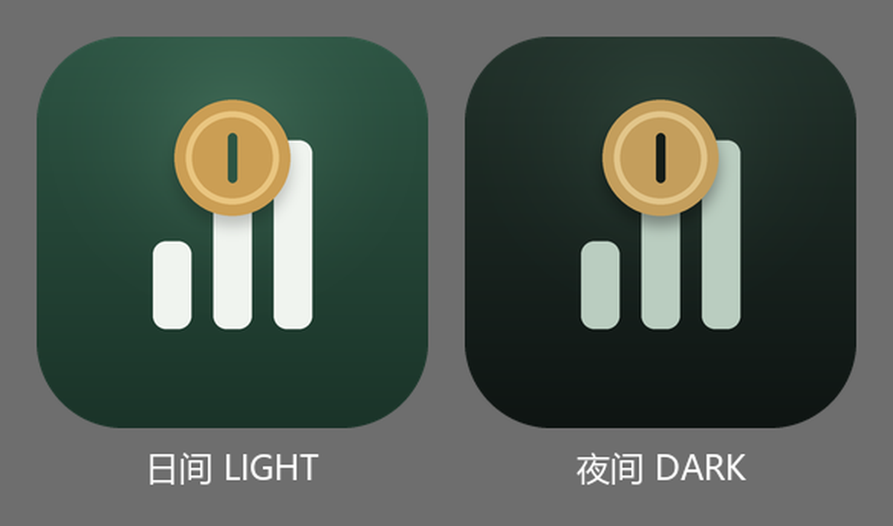
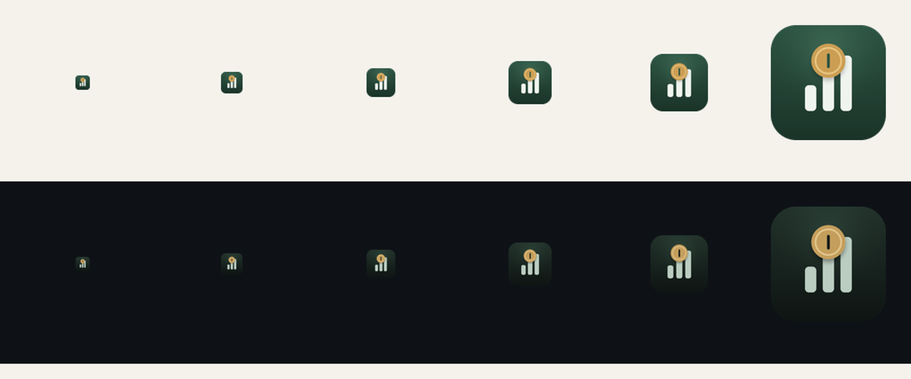

# 飞牛系统主题自动适配 与 双模式应用图标方案

> 版本：v0.4.0 　|　 日期：2026-09-13 　|　 设计：UI Designer

| 项 | 内容 |
| --- | --- |
| 文档版本 | v1.1（对应应用 0.4.0） |
| 制定日期 | 2026-09-13 |
| 文档状态 | 已落地（探测链路、双模式图标与主题联动均已实现并验证） |
| 关联文档 | `docs/界面设计方案.md`（温暖金融科技）· `frontend/src/assets/style.css` · `scripts/make_icons.py` |
| 索引 | `docs/README.md` |

> 关联设计系统：`docs/界面设计方案.md`（温暖金融科技）与 `frontend/src/assets/style.css`

---

## 一、需求与设计目标

| 需求 | 设计目标 |
| --- | --- |
| 实时检测飞牛的日间 / 夜间模式 | 探测延迟 ≤ 一次交互，切换后界面**在一个节拍内**同步，无闪烁 |
| 系统切换时自动同步，无需手动设置 | **零操作**。用户不需要在本应用里做任何设置 |
| 两种模式配色协调、内容清晰可读 | 两套令牌同源推导，正文对比度 ≥ 7:1（AAA 级），次要文本 ≥ 4.5:1 |
| 日间图标：浅色背景下醒目清晰 | 深底 + 亮主体，在浅色桌面上形成**明确的色块轮廓** |
| 夜间图标：深色背景下柔和护眼、对比度适宜 | 压低主体明度与饱和度，去掉高亮纯白，避免光晕与刺眼 |

核心约束：**跨域 iframe 下也必须可用、且首屏绝不能被宿主拖慢**。

---

## 二、飞牛主题的暴露方式（探测结论）

应用以 `type: "iframe"` 嵌在飞牛桌面中（见 `app/ui/config`）。

### 2.1 官方通道（首选）：JS SDK

飞牛开放平台提供官方前端 JS SDK **`@trimjs/web-app`**，主题相关能力有两处：

| 能力 | 签名 | 用途 |
| --- | --- | --- |
| 读初始配置 | `getPlatformConfig(): Promise<PlatformConfig>` | 返回 `theme: 'dark' \| 'light'`、`language`、`systemVersion` 等 |
| 订阅主题变化 | `$on('os/theme', (theme: 'dark' \| 'light') => void)` | **实时推送**，无需轮询 |
| 订阅语言变化 | `$on('os/language', (language: string) => void)` | 界面语言跟随（当前仅记录） |

这是语义最准、实时性最好的通道（推送而非轮询）。接入有两个前置条件：

1. `manifest` 必须声明 **`micro_app=true`**，否则页面不会按微应用环境加载；
2. 必须运行在 **Web 宿主环境**：`sdk.isWeb === true && sdk.isStandaloneWeb === false`。
   移动端 App 内嵌页与独立浏览器页面**不支持** `$on`。

> **实测确认的两条硬约束**（`tests/verify_sdk_integration.py` 已锁定）：
> 1. 独立浏览器页面里调用会抛
>    `Host bridge is not available outside iframe or app runtime`；
> 2. iframe 内若宿主不响应握手，`getPlatformConfig()` 会**永久挂起**
>    （既不 resolve 也不 reject，实测 3 s 无结果）。
>
> 因此 SDK 必须 **动态 import + 超时竞速 + try/catch**，且**绝不可放在首屏关键路径**。
> 它是「有则更好」的增强通道，不承担唯一职责。

### 2.2 兼容通道：localStorage 的 `fnos-theme-mode`

飞牛把主题选择也存在 **localStorage 的 `fnos-theme-mode`**，取值为数字字符串：

| 值 | 含义 |
| --- | --- |
| `'10'` | 日间 / 亮色 |
| `'20'` | 夜间 / 暗色 |

问题在于：这个键**只在同源时可读**。以下场景会被浏览器隔离：

- fn Connect 子域访问（`https://xxx.fnos.net`）→ 应用与宿主不同源
- 独立部署 / 反代到独立端口
- 用户从外部链接直接打开应用（此时根本没有宿主）

所以设计成一条**多级降级链路**，任何一条通就生效。同时**实现细节上前后端各写了一份
归一化逻辑**（内联脚本无法复用 ES 模块，后端也跑不了 JS），因此专门有一个一致性
核对脚本保证两边对同一输入给出同一结论 —— 详见 §8。

### 2.3 其余兜底通道

| 通道 | 说明 |
| --- | --- |
| URL 参数 | `?fnos-theme=dark` 等，跳转页可直接传 |
| 宿主探针 | 同源时回读宿主解析后的实际背景亮度 |
| postMessage | 宿主或中介页主动推送（跨域友好） |
| 后端透传 | `/api/settings/about` 的 `fnos_theme` 字段 |

**后端兜底**：后端会把网关头
`X-Trim-Theme` / `X-Fnos-Theme` / `X-Trim-Theme-Mode` 透传给前端。只要飞牛网关
转发其中的任意一个，跨域场景也能拿到主题。

> 说明：这条后端通道依赖的是非官方契约的请求头，飞牛不同版本未必都带。它属于
> 「有则更好」的加强通道，**不承担唯一职责** —— 其余链路已能覆盖绝大多数部署形态。
> 同理，官方 SDK 通道也是增强项：拿不到时静默降级，界面行为与接入前完全一致。

---

## 三、实现结构

### 3.1 模块划分

```
frontend/src/fnos.js        新增  宿主主题探测与实时订阅（官方 SDK + 多级链路 + 归一化）
frontend/src/theme.js       改造  auto / light / dark 状态机 + 宿主优先级解析
frontend/index.html         改造  首屏内联预判脚本（防闪烁）+ 双模式图标预挂载
frontend/src/main.js        改造  挂载后启动监听 + 拉取后端兜底通道
frontend/src/components/SettingsPanel.vue  改造  新增「外观」块，显示跟随状态
frontend/src/components/ThemeToggle.vue    改造  文案与图标反映「跟随飞牛」
frontend/src/components/AppIcon.vue        改造  新增 sun / moon / host 图标
manifest                    改造  声明 micro_app=true（调用 JS SDK 的前提）
config/resource             改造  显式声明 api-scope（本应用为空数组）
app/api/deps.py             改造  解析网关头主题
app/api/settings.py         改造  /about 透传宿主主题
app/services/settings_service.py  改造  get_about_info 接收主题
app/schemas/settings.py     改造  AboutInfo 增加 fnos_theme 字段
tests/test_theme.py         新增  透传链路与归一化的回归测试（7 例）
tests/test_host_integration.py    新增  宿主集成声明测试（5 例）
tests/verify_theme_parity.py      新增  前后端归一化一致性核对（22 组输入）
tests/verify_sdk_integration.py   新增  SDK 集成契约核对（13 条）
```

### 3.2 优先级决策：为什么飞牛优先于操作系统

`auto`（默认）模式下的解析顺序：

```
手动指定 dark/light   >   飞牛宿主主题   >   prefers-color-scheme
```

飞牛宿主主题内部再分级（高 → 低）：

```
官方 SDK 推送   >   同源 localStorage / URL / 探针 / postMessage / 后端透传
```

理由：应用**嵌在飞牛里**，用户在飞牛设置里选的日间/夜间，才代表当前使用环境的
真实意图。浏览器的 `prefers-color-scheme` 在这个场景里只是个不知道宿主时才会用到的
替代品。如果反过来让浏览器偏好压过飞牛，就会出现「飞牛是夜间、应用却是日间」的
割裂——这正是需求要消除的。

**SDK 优先且具排他性**：一旦 SDK 通过 `$on('os/theme')` 推送过值，就成为权威来源，
次级通道（如跨域下 `/about` 的返回值）不会覆盖它，避免两个来源来回抖动。

### 3.3 实时性：切换后多久能跟上

| 触发路径 | 生效时机 |
| --- | --- |
| **官方 SDK `$on('os/theme')`** | **即时**（宿主推送，毫秒级） |
| 同源 localStorage 写入 | `storage` 事件，**即时**（毫秒级） |
| postMessage 推送 | `message` 事件，**即时** |
| 后端透传（跨域） | 下次拉取 `/about`；另有 4 秒轮询兜底 |
| URL 参数变化 | `popstate` / `hashchange`，**即时** |
| 页面重新可见 | `focus` 事件 |

跨域场景若拿不到 SDK 推送，浏览器不给跨域变更通知，因此用 **4 秒轮询**兜底，且
**仅在 `document.hidden === false` 时探测**，后台标签页零开销。4 秒是刻意的取舍：
对「切换系统主题」这种低频操作，用户感知不到延迟，而不必付出高频轮询的代价。

### 3.4 首屏防闪烁

`index.html` 里有一段**内联**脚本，在 CSS 与模块加载之前就完成主题判定并给
`<html>` 打上 `.dark`。它内置了与 `fnos.js` 相同的优先级与归一化逻辑（内联脚本
不能用 ES 模块，所以逻辑是刻意重复的），保证：

- 暗色用户不会看到一帧浅色
- `<meta name="theme-color">` 与 `<link rel="icon">` 同步预置，浏览器 UI 与图标
  底色在第一帧就与主题匹配

**为什么首屏不用官方 SDK**：SDK 的 `getPlatformConfig()` 是异步的，且需要等宿主
握手（实测最坏情况下会永久挂起），最早也要等 JS 模块加载后才可能有结果——赶不上
第一帧。因此首屏只用**同步可得**的信息（URL / localStorage / 父窗口媒体查询）预判，
SDK 结果到达后由 `theme.js` 接管并修正（此时若值不同，会有一次极快的切换，但因为
SDK 与 localStorage 通常一致，实际不会可见）。

### 3.5 设置页可见性反馈

自动跟随最大的体验风险是**「到底跟上了没有」**。所以设置页新增「外观」块，明确
展示状态，降低用户不确定感（这是可用性问题，不是功能问题）：

- 已跟上 → 徽标显示 `飞牛 · 夜间模式`（主色系，积极状态）
- 未探测到 → 徽标显示 `日间模式`（中性色），并说明"当前跟随浏览器 / 系统偏好"
- 手动锁定 → 提示"不再自动跟随；切回跟随系统即可恢复"
- 保留三个 chip 做手动覆盖：跟随系统 / 日间 / 夜间（默认即「跟随系统」）

---

## 四、配色协调性验证

两套主题共用**同一套四层令牌**（`style.css`），暗色只是换语义层映射，因此
"协调"是结构保证的，不靠逐个组件调色。

### 4.1 正文对比度（WCAG）

| 组合 | 前景 | 背景 | 对比度 | 等级 |
| --- | --- | --- | --- | --- |
| 浅色 · 主要文本 | `#242926` | `#f5f2ec` | **13.6:1** | AAA |
| 浅色 · 次要文本 | `#5c635d` | `#f5f2ec` | **5.9:1** | AA |
| 深色 · 主要文本 | `#e6e9e4` | `#12151a` | **14.2:1** | AAA |
| 深色 · 次要文本 | `#9aa39c` | `#12151a` | **7.4:1** | AAA |
| 浅色 · 收入（暖红） | `#c05548` | `#f5f2ec` | 4.6:1 | AA |
| 浅色 · 支出（苔绿） | `#47825f` | `#f5f2ec` | 4.5:1 | AA |
| 深色 · 收入（暖红） | `#e08576` | `#12151a` | 7.5:1 | AAA |
| 深色 · 支出（苔绿） | `#71b891` | `#12151a` | 8.6:1 | AAA |

收支语义色在浅色下是 4.5:1 的**下限踩线**——这是刻意保留的：它们用于大字号、
等宽加粗的金额，按 WCAG 对大字号（≥18.66px bold）3:1 的要求有充足余量；而在
暗色下则整体抬亮，反而更宽松。

### 4.2 主题色（浏览器 UI）

| 模式 | `theme-color` |
| --- | --- |
| 日间 | `#f5f2ec`（暖米白，与应用底色一致，浏览器地址栏不突兀） |
| 夜间 | `#12151a`（深墨底） |

---

## 五、图标设计方案

### 5.1 造型：秤·币



**一枚铜金色硬币，压在三根等差上升的刻度柱上。**

| 元素 | 语义 |
| --- | --- |
| 刻度柱（3 / 5 / 7 节奏上升） | 收支统计、增长趋势 |
| 硬币（带内圈高光边 + 中央刻痕） | 记账、价值计量 |
| 两者叠加 | 「财务统计」——在增长之上做计量 |

造型刻意保持几何简单：**三个圆角矩形 + 一个圆**。这是为小尺寸服务的决定——
飞牛桌面图标在 64px 甚至 32px 下显示，任何细节都会糊成一团。图形主体控制在
**56% 边长**的安全区内，四周留足呼吸空间，因为飞牛会给图标套圆角遮罩。

### 5.2 两套配色

| | 日间 LIGHT | 夜间 DARK |
| --- | --- | --- |
| 底色渐变 | `#2d5443` → `#1a3328` | `#22322b` → `#0e1412` |
| 顶部柔光 | `#6da386` @34% | `#4e7660` @30% |
| 刻度柱 | `#f0f4ef`（米白） | `#bacdb8`（灰绿，**非纯白**） |
| 硬币面 | `#cb9e54` | `#c49e5c` |
| 硬币高光边 | `#e9c580` | `#e2c58a` |
| 投影 | 黑 @22% | 黑 @35% |

**日间版为什么用深底**：浅色桌面上，深色块形成最强的轮廓识别（对比度原理）。
如果日间版也用浅底，在浅色桌面上会"漂浮"——边界糊掉、辨识度反而下降。

**夜间版压了三处亮度**：
1. 刻度柱从纯白 `#f0f4ef` 降到灰绿 `#bacdb8` —— 纯白在深底上会产生**光晕效应**
   （halation），夜间盯着看眼睛会累
2. 底部渐变压到 `#0e1412`，接近纯黑，与夜间桌面的深色融为一体而不突兀
3. 柔光强度从 34% 降到 30%，去掉浮夸的反光

**硬币刻意没压暗**：它是唯一需要"点睛"的元素。夜间版把硬币边从 `#e9c580` 略微
调整为 `#e2c58a`（降一点蓝、提一点暖），让它在暗底上保持温暖而不刺眼。

### 5.3 尺寸适配验证



上排：浅色桌面 + 日间图标，臂 16 / 24 / 32 / 48 / 64 / 128px。
下排：深色桌面 + 夜间图标，同尺寸。

结论：**32px 是识别的临界点**。再往下的 16 / 24px 硬币与柱群开始融合，但整体
轮廓仍可辨——这是几何化造型的收益，也是不引入更多细节的原因。

### 5.4 产出清单

| 路径 | 尺寸 | 用途 |
| --- | --- | --- |
| `frontend/public/icons/icon-{light,dark}-64.png` | 64 | 浏览器 favicon |
| `frontend/public/icons/icon-{light,dark}-256.png` | 256 | PWA / apple-touch-icon |
| `app/ui/images/icon_{light,dark}_64.png` | 64 | 飞牛桌面小图标 |
| `app/ui/images/icon_{light,dark}_256.png` | 256 | 飞牛桌面大图标 |
| `ICON_{LIGHT,DARK}.PNG` | 64 | 仓库根（与 manifest 同层） |
| `ICON_{LIGHT,DARK}_256.PNG` | 256 | 仓库根 |
| `ICON.PNG` / `ICON_256.PNG` | 64 / 256 | 仓库根，fnpack 打包规范强制要求的中性图标（日间配色） |
| `app/ui/images/icon_{64,256}.png` | 64 / 256 | `app/ui/config` 的 `icon` 字段引用的中性图标（日间配色） |

全部由 `scripts/make_icons.py` 生成（4× 超采样后 LANCZOS 缩小，边缘干净）。
中性版与 light 版同一调色板渲染，保证宿主不识别 `iconLight`/`iconDark` 字段而回退到
`icon` 字段时，桌面显示的图标风格与主题版一致，不会退回旧设计。
`scripts/preview_icons.py` 负责出上面两张验证图。

### 5.5 图标的主题切换机制

**Web 侧**：`index.html` 内联脚本按判定结果挂载对应的 `<link rel="icon">`，
并给额外的图标加 `media="(prefers-color-scheme: dark|light)"`，让浏览器在系统
主题变化时自动切换标签页图标：

```html
<link rel="icon" sizes="64x64" href="./icons/icon-light-64.png" media="(prefers-color-scheme: light)">
<link rel="icon" sizes="64x64" href="./icons/icon-dark-64.png"  media="(prefers-color-scheme: dark)">
```

**飞牛桌面侧**：在 `app/ui/config` 里额外声明两个键（`iconLight` / `iconDark`），
并把两套图标都放进 `app/ui/images/`。这里必须坦诚说明一个事实：

> `iconLight` / `iconDark` **不是飞牛公开文档确认的字段**，属于尝试性适配。
> 飞牛当前版本大概率只读取 `icon`（`images/icon_{0}.png`）。因此保留了
> `icon_{0}.png` 的映射可用性（`icon_{64,256}.png` 已按日间配色重新生成，
> 与 light 版风格一致；`frontend/public/icons` 下旧设计的 `icon-64/256.png` 已删除），
> 若后续飞牛支持双图标字段，这里已就绪；若不支持，也不影响现有行为。

---

## 六、无障碍与体验细节

| 项 | 处理 |
| --- | --- |
| 色彩对比 | 见 §4.1，正文全部达到 AA 以上，主要文本达 AAA |
| 减少动态 | 主题切换仅改类名与 CSS 变量，无过渡动画，天然兼容 `prefers-reduced-motion` |
| 键盘可达 | 主题 chip 为原生 `<button>`，带 `aria-pressed`，`:focus-visible` 有 2px 主色描边 |
| 状态可读 | 「外观」状态徽标为文本 + 图标，不只靠颜色传达状态 |
| 屏幕阅读器 | 所有图标 `aria-hidden="true"`；主题按钮有完整 `aria-label` |
| 反闪烁 | 内联脚本先于样式与模块执行，避免首帧错色 |
| 失败降级 | 探测链任一条失败静默跳过，绝不阻断首屏；后端不可用时前端链路仍有效 |

---

## 七、落地情况

| 文件 | 变更 |
| --- | --- |
| `frontend/src/fnos.js` | **新增** 宿主主题探测与订阅（官方 SDK 通道 + 五级降级链路，含归一化与实时监听） |
| `frontend/src/theme.js` | 重写状态机：宿主优先级解析、`followingFnos` 追踪、后端兜底同步 |
| `frontend/index.html` | 内联首屏预判脚本升级为完整优先级；双模式图标与 `theme-color` 动态预挂载 |
| `frontend/src/main.js` | 挂载后启动监听与后端兜底拉取 |
| `frontend/src/components/SettingsPanel.vue` | 新增「外观」块：跟随状态徽标 + 三 chip 手动覆盖 |
| `frontend/src/components/ThemeToggle.vue` | 图标与文案反映「跟随飞牛 / 跟随系统」的真实来源 |
| `frontend/src/components/AppIcon.vue` | 新增 `sun` / `moon` / `host` 三个图标 |
| `frontend/src/chartTheme.js` | 新增 `heatRamp()`：热力型色阶从 `--pine-*` 逐阶取值，深浅随主题反转 |
| `frontend/src/components/ConsumptionMapPanel.vue` | 色阶改走 `heatRamp()`，消除 10 处硬编码色值 |
| `frontend/public/manifest.webmanifest` | 图标清单扩为日夜两套；`theme_color` 改为应用底色 |
| `frontend/package.json` | **新增依赖** `@trimjs/web-app`（飞牛官方 JS SDK）；版本 0.3.0 → **0.4.0** |
| `manifest` | **新增** `micro_app=true`（调用 JS SDK 的前提）；版本 0.3.0 → **0.4.0** |
| `config/resource` | **新增** 显式声明 `api-scope`（本应用只读主题/语言，为空数组） |
| `app/api/deps.py` | `GatewayUser` 增加 `theme_raw`；解析三种可能的网关头主题 |
| `app/api/settings.py` | `/api/settings/about` 透传宿主主题 |
| `app/services/settings_service.py` | `get_about_info(theme)` 接收并回传 |
| `app/schemas/settings.py` | `AboutInfo` 增加 `fnos_theme` 字段 |
| `app/ui/config` | 增加 `iconLight` / `iconDark` 尝试性字段 |
| `scripts/make_icons.py` | 重写为双模式图标生成器（超采样 + 圆角遮罩 + 预览）；补齐中性版目标（`ICON.PNG`/`icon_{64,256}.png` 按日间配色生成） |
| `scripts/preview_icons.py` | **新增** 图标适配验证图生成 |
| `tests/test_theme.py` | **新增** 主题透传与归一化回归测试（7 例） |
| `tests/test_host_integration.py` | **新增** 宿主集成声明测试（5 例） |
| `tests/verify_theme_parity.py` | **新增** 前后端归一化一致性核对脚本 |
| `tests/verify_sdk_integration.py` | **新增** SDK 集成契约核对脚本（13 条） |
| 图标文件 | 新增 12 个 PNG（web 4 / 飞牛桌面 4 / 仓库根 4） |
| `manifest` | 版本 0.3.0 → **0.4.0**，changelog 补本次变更 |
| `app/config.py` | `APP_VERSION` 0.3.0 → **0.4.0**（与 manifest 同步） |

---

## 八、验证与已知限制

### 已完成的验证

1. **前端构建**：`vite build` 通过，605 个模块
   - `index.html` 5.47 kB（gzip 2.52 kB）
   - `index-*.css` 53.09 kB（gzip 9.83 kB）
   - `index-*.js` 163.68 kB（gzip 60.67 kB）
   - `index-*.js`（**官方 SDK 独立 chunk**）36.59 kB（gzip 11.08 kB）
     —— 动态 `import()` 自动拆分，SDK 不拖累主包首屏
   - `echarts-*.js` 593.90 kB（gzip 198.91 kB，独立长缓存 chunk，已低于 600 kB 告警线）
2. **后端测试**：`pytest tests` **248 个用例全部通过**（评审修复补齐管理员守卫回归后 +7）
   - `tests/test_theme.py` 7 例：三种候选头名、优先级、无头降级、非法值、`/about` 透传
   - `tests/test_host_integration.py` 5 例（**本次新增**）：锁定 `micro_app=true`、
     iframe 入口类型、`api-scope` 为空数组、双模式图标齐全、SDK 依赖存在
3. **前后端归一化一致性**：`tests/verify_theme_parity.py` 用 22 组输入
   （数字码 / 单词 / 大小写 / 空白 / 布尔 / 无法识别值）交叉核对前端
   `normalizeTheme` 与后端 `normalize_theme`，**22/22 结论一致**
   —— 这是本方案最容易出隐性 bug 的地方（两处独立实现），所以单独加了核对脚本
4. **SDK 集成契约**：`tests/verify_sdk_integration.py` **13/13 条成立**（**本次新增**）
   - SDK 返回值域 `'light' | 'dark'` 被正确归一化（含大小写、空白、空值）
   - `inIframe()` 判定：iframe 内为 `true`、独立页面为 `false`
   - `withTimeout()`：挂起 Promise 在 214 ms 内走 fallback；正常 resolve 不被超时覆盖；
     reject 被吞掉并走 fallback（SDK 无宿主时正是 reject）
5. **SDK 真实行为实测**（在 Node 中模拟宿主环境，结论已写入 `fnos.js` 注释）
   - 独立浏览器页面：`isWeb: true`、`isStandaloneWeb: true`，
     `getPlatformConfig()` 与 `$on()` 均抛
     `Host bridge is not available outside iframe or app runtime`
   - iframe 内但宿主不响应握手：`isStandaloneWeb: false`（看似"已托管"），
     但 `getPlatformConfig()` **3 s 仍无结果（既不 resolve 也不 reject）**
     —— 这是必须加超时的直接证据，也是「首屏路径绝不 await SDK」的原因
6. **端到端**：本地 `uvicorn` 启动后实测
   - `GET /` → 200，正确引用新产物，7 处 `prefers-color-scheme` 媒体查询就位
   - `GET /api/settings/about` 带 `X-Trim-Theme: 20` → `fnos_theme: "20"`
   - 带 `X-Fnos-Theme: 10` → `"10"`；带 `X-Trim-Theme-Mode: dark` → `"dark"`
   - 无主题头 → `""`（正确降级，不报错）
   - 4 个新图标资源与 `manifest.webmanifest` 全部 200 可取
7. **图标**：16 / 24 / 32 / 48 / 64 / 128px 六个尺寸在浅底与深底上逐一目视确认
8. **令牌一致性**：新增样式引用的 13 个 CSS 令牌全部存在于 `style.css`；
   同时把同期并入的「消费地图」色阶从硬编码改为走 `chartTheme.heatRamp()`
   （从 `--pine-*` 基础调色板逐阶取值），该组件现已无硬编码色值
9. **对比度**：§4.1 全部组合经公式计算确认

### 已知限制（需在真机确认）

1. **飞牛真实头名未确认**：`X-Trim-Theme` / `X-Fnos-Theme` / `X-Trim-Theme-Mode`
   三者都是尝试，需要在实际飞牛环境用浏览器开发者工具抓一次请求头确认。
   若都未命中，跨域场景会退化到 4 秒轮询 —— 功能仍成立，只是延迟变长。
   （注意：官方 SDK 通道若能正常工作，这条后端通道就不再是必要路径。）
2. **SDK 需要宿主版本支持**：`getPlatformConfig` 与 `$on('os/theme')` 官方要求
   **系统 ≥ 1.2.0401、App ≥ 1.34.0**。低于此版本时 SDK 调用会失败或挂起，本实现
   已用超时 + try/catch 兜住，界面行为与未接入时一致。
3. **`iconLight` / `iconDark` 是尝试性字段**，见 §5.5 的说明。
4. **未做浏览器自动化截图**：环境无 Chromium。建议在飞牛设备上按以下步骤实测：
   - 飞牛设置里切换日间/夜间 → 观察应用是否**在一个节拍内**跟随（SDK 通时应为即时）
   - 检查设置页「外观」徽标是否显示「飞牛 · 夜间模式」
   - 桌面图标在日间/夜间下分别是否清晰（尤其 64px）
   - 切到 fn Connect 子域访问，确认降级链路仍能跟上

---

## 九、后续演进空间

| 方向 | 说明 |
| --- | --- |
| **语言跟随** | SDK 的 `os/language` 已接入并记录到 `fnosLanguage`，界面文案仍以中文为主；若将来需要多语言，直接订阅该值即可 |
| 主题跟随的粒度 | 目前只有日间/夜间二元；未来飞牛若支持多主题（如护眼黄），需扩展归一化映射 |
| 图标动态生成 | 若主题系统进一步细化，可把 `make_icons.py` 的调色板抽出为配置，按需扩展第三套 |
| 设置页状态可诊断 | 可加一个「主题探测诊断」折叠区，列出全部链路（含 SDK）的命中情况，便于用户自助排查 |
| 简化降级链路 | 若真机确认 SDK 通道稳定可用，可考虑把 URL / 探针 / 后端透传三条降级删掉，代码量减半 |
